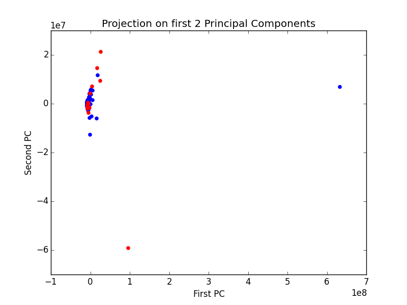
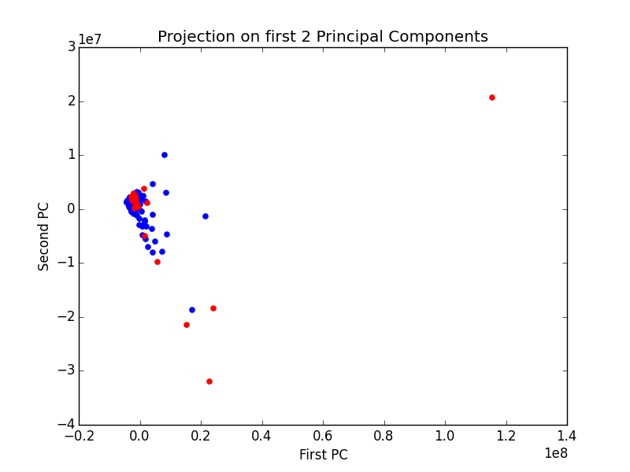
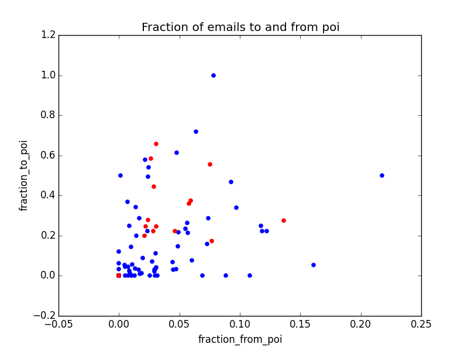

#Enron fraud detection

## Machine Learning Application


## Introduction

This project is an application of **machine learning** for identifying persons that were involved in fraud at Enron. Machine learning can be used to detect those persons by investigating financial and email data of Enron employees, to find patterns 

Enron is a case of large scale corporate fraud in USA. During prosecution, the court decided to make public the financial data and also the emails. Enron executives decided to destroy a lot of documents while they were in prosecution. This fact may have contributed to the decision of the court to make the emails public.

## Investigation

### Loading data

The first step is loading the data and playing with it to understand the structure. I usually do this in a console. For this project the provided pickle file contains a dictionary, with the keys as strings containting the names of enron employees, and the values as dictionaries that contain some features.

**Number of elements:** 146
**Number of pois:** 18

Actually, there were 35 persons involved in fraud, but the data set we have available only contains about half of them. This may be a problem, the number of examples of persons involved in fraud is very small, and it will be very hard to find meaningful patterns.
We may have biased results. Any investigation we perform will be incomplete, and most likely biased (unless the people missing would be randomly selected, such that the sample we have is statistically representative, but this is unlikely due to the very limited examples).

For a machine learning project, there's not much difference between 18 and 35 data points. This dataset is definitely small, and hence difficult to asses the accuracy.

**Features available:** 21

### Selecting features

In order to select the most useful features, I wanted to see what features have missing values, and how many missing values are there in each feature.

Here's my result:

| Feature name                          | Percent of non-Nan|
|----------------------------------------------|-------------------|
|<font color = 'green'>total_stock_value       | `0.868965517241`  |
|<font color = 'green'>total_payments          | `0.862068965517`  |
|<font color = 'green'>restricted_stock        | `0.758620689655`  |
|<font color = 'green'>exercised_stock_options | `0.703448275862`  |
|<font color = 'green'>salary                  | `0.655172413793`  |
|<font color = 'green'>expenses                | `0.655172413793`  |
|<font color = 'green'>other                   | `0.641379310345`  |
|<font color = 'green'>to_messages             | `0.593103448276`  |
|<font color = 'green'>shared_receipt_with_poi | `0.593103448276`  |
|<font color = 'green'>from_messages           | `0.593103448276`  |
|<font color = 'green'>from_poi_to_this_person | `0.593103448276`  |
|<font color = 'green'>from_this_person_to_poi | `0.593103448276`  |
|<font color = 'green'>bonus                   | `0.565517241379`  |
|<font color = 'red'>long_term_incentive       | `0.455172413793`  |
|<font color = 'red'>deferred_income           | `0.337931034483`  |
|<font color = 'red'>deferral_payments         | `0.268965517241`  |
|<font color = 'red'>restricted_stock_deferred | `0.124137931034`  |
|<font color = 'red'>director_fees             | `0.11724137931`   |
|<font color = 'red'>loan_advances             | `0.0275862068966` |

For now I'll select only the features that have at least 50% of values filled (non-NaN values), so the <font color = 'green'>green</font> ones I selected for further investigation. Later I may slect from those the features that have the best predicting power.


### Outliers

Rather than trying to guess on what features the outliers may be observed, I decided to use PCA for this. If a point in our data set has a large deviation from most of the points, this large deviation should be caught by the first couple of principal components.

An important aspect here is that if I remove a point from the data set, I should run PCA again because the principal components are greatly influenced by outliers. The new principal components may lay in different directions.

The first plot (red points are poi):


The point that has a value of over $5 *10^8$ on the first principal component looks like an outlier. I print the key associated with the point:
```
"TOTAL"
```

So this is clearly an outlier that comes from the spreadsheet from which this data was exported. We are looking to compare employers of Enron, so the total of all salaries, bonuses, etc, should not be in our data set.

I remove it and repeat.

The second plot:


I will print the top two elements from the second component, and also the smallest one from the second component:
```
['BHATNAGAR SANJAY', 'LAY KENNETH L']
'HIRKO JOSEPH'
```
Ok, so they are Enron employees, I'll leave them in the data set.


## Feature Engineering

Except those features, we can also use the emails. I ran some experiments on text, to see what words a Decision Tree algorithm uses to distinguish between emails from two persons, Sara Shackelton and Chris Germany. Here is my output:

### Text learning experiment

```
train acc: 1.0
test acc:  0.983333333333
Most important feature, and relative importance: cgermannsf : 0.973656480506

train acc: 1.0
test acc:  0.966666666667
Most important feature, and relative importance: sara : 0.923103212577

train acc: 1.0
test acc:  1.0
Most important feature, and relative importance: tjonesnsf : 0.51800776543

train acc: 1.0
test acc:  0.866666666667
Most important feature, and relative importance: chris : 0.437839234944

train acc: 1.0
test acc:  0.933333333333
Most important feature, and relative importance: shackleton : 0.321660482375
--------------------
top 5 most important words:
[u'cgermannsf', u'sara', u'tjonesnsf', u'chris', u'shackleton']
```

It looks like all those are signature words. I'm concerned that for deciding whether a person is a poi or not, an algorithm using text may rely on previously known information. This decision tree can reach 100% accuracy, but it only looks at the signatures of the emails.
In case of a poi vs non-poi classifier, the algorithm may rely on names of persons rather than more complex vocabulary to detect suspicious activity.

I'll try to engineer a feature from the data set available.

### Fraction of emails to and from poi

If I plot the number of sent emails to poi vs number of emails received from poi, I get the following plot:


There doesn't seem to be a pattern here. I'll try to compute the fraction of emails send to poi and received from poi rather than the number of emails.



This plot looks good. There's not a very strong separation between poi and non-poi, but there is some separation. There are areas in this plot where there are only non-poi.

## Classifiers

### Try Classifiers Out of the Box

First I'll try a couple of classifiers out of the box. I'll test the following classifiers:

- Decision Trees
- Ada Boost
- KNC
- Gaussian Naive Bayes
- Logistic Regression
- SVC


The results are the following:
 <font face='mono'>
 **GaussianNB**()

	Accuracy: 0.83787	
	Precision: 0.32524	
	Recall: 0.20100	
	F1: 0.24845	
	F2: 0.21763

	Total predictions: 15000	
	True positives:  402	
	False positives:  834	
	False negatives: 1598	
	True negatives: 12166

Got a divide by zero when trying out: 
**SVC**(C=1.0, cache_size=200, class_weight=None, coef0=0.0,
  decision_function_shape=None, degree=3, gamma='auto', kernel='rbf',
  max_iter=-1, probability=False, random_state=None, shrinking=True,
  tol=0.001, verbose=False)
Precision or recall may be undefined due to a lack of true positive predicitons.

**DecisionTreeClassifier**(class_weight=None, criterion='gini', max_depth=None,
            max_features=None, max_leaf_nodes=None, min_samples_leaf=1,
            min_samples_split=2, min_weight_fraction_leaf=0.0,
            presort=False, random_state=None, splitter='best')
  
	Accuracy: 0.82813	
	Precision: 0.35026
	Recall: 0.33800
	F1: 0.34402
	F2: 0.34038

	Total predictions: 15000
	True positives:  676
	False positives: 1254
	False negatives: 1324
	True negatives: 11746

**AdaBoostClassifier**(algorithm='SAMME.R', base_estimator=None,
          learning_rate=1.0, n_estimators=50, random_state=None)

	Accuracy: 0.84353
	Precision: 0.38712
	Recall: 0.29750
	F1: 0.33644
	F2: 0.31194

	Total predictions: 15000
	True positives:  595
	False positives:  942
	False negatives: 1405
	True negatives: 12058

**KNeighborsClassifier**(algorithm='auto', leaf_size=30, metric='minkowski',
           metric_params=None, n_jobs=1, n_neighbors=5, p=2,
           weights='uniform')
  
	Accuracy: 0.88727	
	Precision: 0.75537	
	Recall: 0.22850	
	F1: 0.35086	
	F2: 0.26554

	Total predictions: 15000	
	True positives:  457	
	False positives:  148	
	False negatives: 1543	
	True negatives: 12852

**LogisticRegression**(C=1.0, class_weight=None, dual=False, fit_intercept=True,
          intercept_scaling=1, max_iter=100, multi_class='ovr', n_jobs=1,
          penalty='l2', random_state=None, solver='liblinear', tol=0.0001,
          verbose=0, warm_start=False)
  
	Accuracy: 0.73460	
	Precision: 0.10648	
	Recall: 0.13400	
	F1: 0.11866	
	F2: 0.12741
  
	Total predictions: 15000	
	True positives:  268	
	False positives: 2249	
	False negatives: 1732	
	True negatives: 10751
</font>

I will use the $F_1$ score to decide what algorithm I will chose for the next step. The $F_1$ score combines precision and recall into one measure. The formula is the following:

$$
F_1 = 2 \cdot \frac{P \cdot R}{P+R}
$$

Where:
 $P$ = precision
 $R$ = recall

This metric considers precision and recall as equaly important. There are other metrics that put more weight on either precision or recall ($F_2$ puts more weight on precision).

Using $F_1$ score, the best performing algorithm is KNN followed by Decision Trees. Ada Boost is also very close to the performance of the Decision Tree algorithm.

### Tune Classifiers

I'll use GridCV to find the best tuning parameters. I'll start with KNN

A potential limitation of this algorithm in this case is the fact that we have a very small number of positive examples. Since the algorithm relies on nearest points, it may be difficult to obtain high recall. It will output negative for most of the times, since it has very few examples of positive pois. This can be solved using different weights for positive and negative classes.

#### KNC

<font face='mono'>
	**KNeighborsClassifier**(algorithm='auto', leaf_size=30, metric='minkowski',
           metric_params=None, n_jobs=1, n_neighbors=5, p=2,
           weights='uniform')

	Accuracy: 0.88727
	Precision: 0.75537
	Recall: 0.22850
	F1: 0.35086
	F2: 0.26554

	Total predictions: 15000
	True positives:  457
	False positives:  148
	False negatives: 1543
	True negatives: 12852
</font>

This looks the same as the KNC I had before.

#### Decision Tree

<font face='mono'>

**DecisionTreeClassifier**(class_weight=None, criterion='gini', max_depth=None,
            max_features=None, max_leaf_nodes=None, min_samples_leaf=1,
            min_samples_split=2, min_weight_fraction_leaf=0.0,
            presort=False, random_state=None, splitter='best')

	Accuracy: 0.82573
	Precision: 0.33893
	Recall: 0.32300
	F1: 0.33077
	F2: 0.32607

	Total predictions: 15000
	True positives:  646
	False positives: 1260
	False negatives: 1354
	True negatives: 11740

</font>

The Decision Tree has better recall, but lower precision. The $F_1$ score is higher than the score for K Neighbors Classifier. I would chose this classifier as the final one to use in this project.

### Features

**Testing the new features**

I will test the performance of the algorithm with and without the new features:

<font face='mono'>
Selecting best features for Decision Tree
Performance with all features

| Feature | Importance |
|---------|----------|
| bonus | `0.397261173535` |
| expenses | `0.23848965585` |
| restricted_stock | `0.121017988532` |
| total_payments | `0.10882132898` |
| other | `0.106100795756` |
| fraction_to_poi | `0.0283090573472` |
| total_stock_value | `0.0` |
| exercised_stock_options | `0.0` |
| salary | `0.0` |
| to_messages | `0.0` |
| shared_receipt_with_poi | `0.0` |
| from_messages | `0.0` |
| from_poi_to_this_person | `0.0` |
| from_this_person_to_poi | `0.0` |
| fraction_from_poi | `0.0` |

DecisionTreeClassifier(class_weight=None, criterion='gini', max_depth=None,
            max_features=None, max_leaf_nodes=None, min_samples_leaf=1,
            min_samples_split=2, min_weight_fraction_leaf=0.0,
            presort=False, random_state=None, splitter='best')

	Accuracy: 0.82527
	Precision: 0.34085
	Recall: 0.33250
	F1: 0.33662
	F2: 0.33414

	Total predictions: 15000
	True positives:  665
	False positives: 1286
	False negatives: 1335
	True negatives: 11714

_____________________________

**Performance without 'fraction_from_poi' and 'fraction_to_poi'**

Selecting best features for Decision Tree

| Feature | Importance |
|---------|----------|
|bonus | `0.397261173535` |
|expenses | `0.23848965585` |
|total_payments | `0.10882132898` |
|other | `0.106100795756` |
|from_poi_to_this_person | `0.0757862826828` |
|restricted_stock | `0.0620731020005` |
|from_this_person_to_poi | `0.0114676611954` |
|total_stock_value | `0.0` |
|exercised_stock_options | `0.0` |
|salary | `0.0` |
|to_messages | `0.0` |
|shared_receipt_with_poi | `0.0` |
|from_messages | `0.0` |


DecisionTreeClassifier(class_weight=None, criterion='gini', max_depth=None,
            max_features=None, max_leaf_nodes=None, min_samples_leaf=1,
            min_samples_split=2, min_weight_fraction_leaf=0.0,
            presort=False, random_state=None, splitter='best')

	Accuracy: 0.80233
	Precision: 0.25320
	Recall: 0.24750
	F1: 0.25032
	F2: 0.24862

	Total predictions: 15000
	True positives:  495
	False positives: 1460
	False negatives: 1505
	True negatives: 11540
</font>

So those features clearly affect the performance of the Decision Tree. At least `fraction_to_poi` should be included in the algorithm.

Out of the features that I selected in the begining, I'll select now only the most useful ones, based on the importance assigned by the Decision Tree algorithm.

I decided to implement my own selection of features because in case of SelectKBest function, I don't know what the K should be (although it's true I can find this out, but I'd like to write code to figure this out, rather than manually inspect and code with the number of features I found). The same is true in case of SelectPercentile. I don't know what percentage of features are useful. But I can look at the importance of features, and select all features that contrubute with at least 1% (in the case of decision trees, this means select features that are used to distinguish at least 1% of the data).
I performed this selection, and ended up with only a handful of features:

For final classifier, will pick the best of:

| Feature                       | Importance |
|-------------------------------|----------------------|
| <font color="green">bonus </font> | `0.397261173535` |
| <font color="green">restricted_stock </font> | `0.168173897756` |
| <font color="green">other </font> | `0.132625994695` |
| <font color="green">total_payments </font> | `0.10882132898` |
| <font color="green">expenses </font> | `0.105863661155` |
| <font color="green">from_poi_to_this_person </font> | `0.0589448865311` |
| <font color="green">fraction_to_poi </font> | `0.0283090573472` |
| <font color="red">total_stock_value </font> | `0.0` |
| <font color="red">exercised_stock_options </font> | `0.0` |
| <font color="red">salary </font> | `0.0` |
| <font color="red">to_messages </font> | `0.0` |
| <font color="red">shared_receipt_with_poi </font> | `0.0` |
| <font color="red">from_messages </font> | `0.0` |
| <font color="red">from_this_person_to_poi </font> | `0.0` |
| <font color="red">fraction_from_poi </font> | `0.0` |


So when I test the algorithm only with the features highlighted in green I get the following result:
<font face='mono'>
Feature importances for final classifier

| Feature | Importance |
|---------|----------|
| total_payments | `0.315958946149` |
| restricted_stock | `0.224691893457` |
|exercised_stock_options | `0.171111111111` |
|total_stock_value | `0.1322681593` |
|salary | `0.100088785949` |
|expenses | `0.055881104034` |


DecisionTreeClassifier(class_weight=None, criterion='gini', max_depth=None,
            max_features=None, max_leaf_nodes=None, min_samples_leaf=1,
            min_samples_split=2, min_weight_fraction_leaf=0.0,
            presort=False, random_state=None, splitter='best')

	Accuracy: 0.82833
	Precision: 0.35111
	Recall: 0.33900
	F1: 0.34495
	F2: 0.34136

	Total predictions: 15000
	True positives:  678
	False positives: 1253
	False negatives: 1322
	True negatives: 11747
</font>

So we can see that the accuracy is about the same. I think we can use this subset of features to investigate.

**Note:** For Decision Trees scaling is not necesary. Decision trees look for the best split for one variable at a time. If the variable is scaled, the split point will be at a different location (different numerical value), but it won't make any difference for the classification process.

I would like to point out that some features that were provided in the data set may be responsible for information leakage. Thise features are `from_poi_to_this_person`, `from_this_person_to_poi` and `shared_receipt_with_poi`. Those values are computed using the whole data set. In other words, in order to find this information, the values of those variables, we needed to know who is a poi. In orded to compute those numbers, the whole data set was used, both the train set and the test set. In the real world though, we may identify a couple of pois (a small number, 2-3) and then compute those features using only the pois that we identified. In that case, the features will have less predictive power, because we won't count shared emails or receipts between all pois, only between the ones we identified.

### Validation

Validation is the process of determining the performance of the algorithm. For validation it is necesary to split the available data in training and test data. The algorithm will be trained on the training data only, and it never sees the corect results for test data. We then apply the classification algorithm on the test data, and compare it with the real values.

In order to validate an algorithm we need an objective way to asses its performance. We have to use some metrics like precision, recall, $F_1$ score, $F_2$ score.

### Metrics

This particular project has some limitations because the data set is very small. As I showed in the introduction, there are 18 pois out of 145 (after I removed the "TOTAL" there are 145 points left in the data set).

Because there are unbalanced examples (a lot of non-pois and just a couple of pois), it is necesary to use **precision** and **recall** to asses the performance of the algorithm.
Some algorithms favor precision over recall (like KNC), while others can be tuned to find a balance point in-between.

**Precision** measures the ratio of corectly identified events (persons of interest in this case), over the number of events reported positive by the algorithm. For example, KNC has high precision, this is because KNC clasifies a point based on the similarity with other points. But because there are a lot of negative examples in the data set, the clasifier is more likely to find examples of negative points (non-poi). On the other hand, when it does report a poi, this point is most likely in the center of other pois, so it's very likely a poi. An algorithm with high precision might miss edge cases, but when it does output a point as a poi, it is very likely a poi.

$$
P = \frac{TP}{TP + FP}
$$

$P$ = precision
$TP$ = true positives
$FP$ = false positives

**Recall** measures the ratio of corectly identified points (pois in this case) out of all positive points. If an algorithm has high recall, if there is a poi in the data set, the algorithm is very likely to find it. On the other hand, it may output a lot of false positive. Note that it is very easy to create an algorithm with recall=1, simply output true for every element.

$$
R = \frac{TP}{TP + FN}
$$

$R$ = recall
$TP$ = true positives
$FN$ = false negatives

I also consider $F_1$ and $F_2$ scores. Those metrics simply combine precision and recall in a single number. $F_1$ aims at finding the right balance between precision and recall, while $F_2$ places more weight on recall.

$$
F_1 = 2 \cdot \frac{P \cdot R}{P+R}
$$
$$
F_2 = 5 \cdot \frac{P \cdot R}{4P+R}
$$

Where:
 $P$ = precision
 $R$ = recall

## Conclusion

In this project I showed how Machine Learning could be used to identify persons involved in fraud using financial data and some agregated data about email activity. This particular data set is pretty small, so the results may not be great, but even so, the final classifier has 0.82 accuracy, with precision and recall about 0.33. I believe Machine Learning can be used for this application to obtain some insight into the fraudulent activity. Also, Machine Learning can be used with similar information about employees to asses engagement level of employees, or probability that they will switch jobs.

